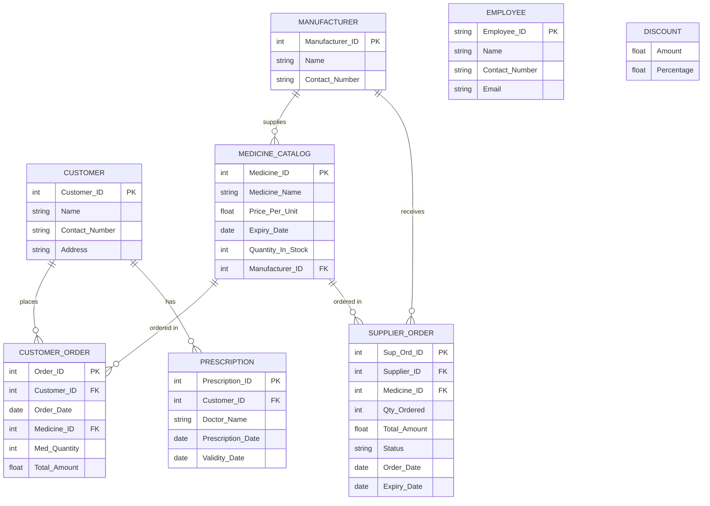

# Pharmacy Management System

A full-stack web application for managing pharmacy operations — customers, medicine inventory, prescriptions, employee records, customer orders, and supplier (manufacturer) orders.

Built with a **React (Vite)** client and a **Node.js / Express** server backed by **MySQL**.

## Tech stack

| Layer    | Technology |
|----------|------------|
| Frontend | React, Vite, CSS |
| Backend  | Node.js, Express (`server.js`, `routes/`) |
| Database | MySQL 8 (`db.js` connection) |
| Config   | `.env` for environment variables |

## Project structure

```
pharmacy/
├── client/                # React + Vite frontend
│   ├── public/
│   └── src/
│       ├── assets/
│       ├── components/
│       │   ├── AdNavbar.jsx
│       │   ├── CustDetModal.jsx
│       │   ├── MedicineCard.jsx
│       │   ├── MedOrderCard.jsx
│       │   ├── NewMedModal.jsx
│       │   ├── OrderModal.jsx
│       │   └── PhNavbar.jsx
│       ├── pages/
│       │   ├── Admin.jsx
│       │   ├── Discount.jsx
│       │   ├── Login.jsx
│       │   ├── Manufacturer.jsx
│       │   ├── Orders.jsx
│       │   ├── Pharmacy.jsx
│       │   └── Update.jsx
│       ├── styles/
│       ├── App.jsx
│       ├── App.css
│       ├── index.css
│       └── main.jsx
│
└── server/                 # Express backend
    ├── routes/              # API route handlers
    ├── db.js                # MySQL connection
    ├── server.js             # App entry point
    └── .env                  # Environment variables (not committed)
```

## Features

- **Authentication** — login page for staff/admin access
- **Medicine catalog** — view, add, and update medicines with stock and expiry tracking
- **Customer orders** — place and manage customer purchases
- **Prescriptions** — link prescriptions to customers with doctor name, date, and validity
- **Manufacturers / suppliers** — manage manufacturer records and supplier (restock) orders
- **Discounts** — configure discount tiers by amount/percentage
- **Admin dashboard** — central page for managing the above

## Database schema

The database (`pharamacy_management`) consists of 8 tables:

| Table | Purpose |
|-------|---------|
| `customer` | Customer profile records |
| `customer_order` | Orders placed by customers for specific medicines |
| `medicine_catalog` | Medicine inventory, pricing, stock, and expiry |
| `manufacturer` | Manufacturers, who also act as suppliers |
| `supplier_order` | Restock orders placed with manufacturers |
| `prescription` | Prescriptions linked to customers |
| `employee` | Staff/employee records |
| `discount` | Discount amount/percentage configuration |

### Entity-relationship diagram



> `employee` and `discount` are standalone tables in the current dump — they don't carry a foreign key to the other tables.

**Notable constraints:**
- `customer_order.Customer_ID` → `customer.Customer_ID` (`ON DELETE CASCADE`)
- `customer_order.Medicine_ID` → `medicine_catalog.Medicine_ID`
- `prescription.Customer_ID` → `customer.Customer_ID` (`ON DELETE CASCADE`)
- `medicine_catalog.Manufacturer_ID` → `manufacturer.Manufacturer_ID` (`ON DELETE CASCADE`)
- `supplier_order.Supplier_ID` → `manufacturer.Manufacturer_ID` (`ON DELETE CASCADE`)
- `supplier_order.Medicine_ID` → `medicine_catalog.Medicine_ID`
- `supplier_order.Status` is an `ENUM('Pending','Completed','Cancelled')`, default `'Pending'`

## Getting started

### Prerequisites

- Node.js (v16+ recommended)
- npm
- MySQL Server 8.x

### 1. Clone the repository

```bash
git clone https://github.com/Janice25dsouza/Pharmacy-Management-System.git
cd Pharmacy-Management-System
```

### 2. Set up the database

Create the database and import the provided SQL dump:

```bash
mysql -u root -p -e "CREATE DATABASE pharamacy_management"
mysql -u root -p pharamacy_management < path/to/dump.sql
```

### 3. Configure the server

Inside `server/`, create a `.env` file with your database credentials, for example:

```
DB_HOST=localhost
DB_USER=root
DB_PASSWORD=your_password
DB_NAME=pharamacy_management
PORT=5000
```

Install dependencies and start the server:

```bash
cd server
npm install
npm start
```

### 4. Run the client

In a separate terminal:

```bash
cd client
npm install
npm run dev
```

The client will start on the Vite dev server (default `http://localhost:5173`) and the API on the port set in `.env` (default above: `5000`).

## API

Backend routes live under `server/routes/` and are wired up in `server.js`, using `db.js` for the MySQL connection pool. Typical endpoints cover CRUD operations for customers, medicines, orders, prescriptions, manufacturers, and discounts — see the `routes/` folder for the exact paths.

